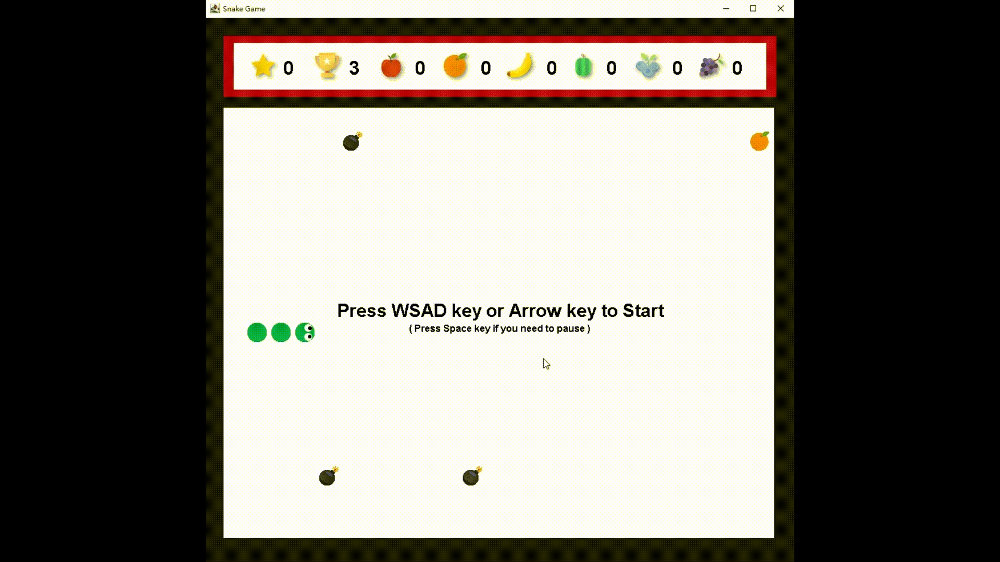

# The Colorful Snake

## Introduction

Welcome to "The Colorful Snake," a fun and engaging Java-based snake game that I developed during my freshman year to learn the Java programming language using Eclipse.

### Gameplay

In "The Colorful Snake," you control a vibrant snake on its quest for a colorful feast. Here are some key features of the game:

- **Colorful Food:** Six different types of food items, each corresponding to a color:
  - Strawberry (Red)
  - Orange (Orange)
  - Banana (Yellow)
  - Watermelon (Green)
  - Blueberry (Blue)
  - Grape (Purple)
- **Colorful Snake:** As the snake consumes each type of food, it adds the corresponding color to its body.
- **Bomb Challenge:** To increase the excitement and difficulty, eating food also increases the number of bombs in the game.

## How to Play

- Use the arrow keys or WASD to navigate the snake.
- Collect colorful food items to increase your snake's length and color palette.
- Beware of bombs! Hitting a bomb ends the game.
- The challenge is to survive, grow, and create a beautiful and colorful snake.

## Installation

1. Clone this repository to your local machine.
2. Run the game using your Java development environment (e.g., Eclipse).
3. Enjoy the colorful adventure of "The Colorful Snake"!

## Contributing

If you'd like to contribute to this project or provide feedback, please feel free to open an issue or submit a pull request.

## License

This project is licensed under the [MIT License](LICENSE).

---

Experience the world of "The Colorful Snake" as you navigate its vibrant journey and build a rainbow serpent!
